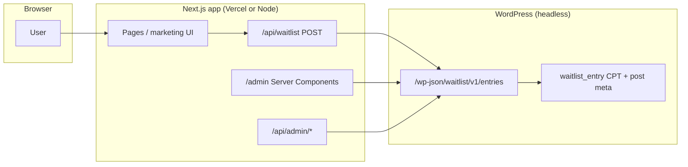

# GetImmiHub — Project Documentation

This document describes the **GetImmiHub** codebase: a marketing-style Next.js frontend for the **ImmiHub** product (immigration document tracking and reminders), integrated with a **WordPress-powered waitlist API** deployed via the **Code Snippets** plugin. It is intended for developers onboarding to the project or operating it in production.

---

## Table of contents

1. [Overview](#1-overview)
2. [Architecture at a glance](#2-architecture-at-a-glance)
3. [Technology stack](#3-technology-stack)
4. [Repository layout](#4-repository-layout)
5. [Frontend (Next.js)](#5-frontend-nextjs)
6. [Next.js API routes (application bridge)](#6-nextjs-api-routes-application-bridge)
7. [WordPress backend (`Waitlist-rest-api.php`)](#7-wordpress-backend-waitlist-rest-apiphp)
8. [Environment variables](#8-environment-variables)
9. [Data contracts (waitlist)](#9-data-contracts-waitlist)
10. [Admin UI behavior and WordPress integration](#10-admin-ui-behavior-and-wordpress-integration)
11. [Analytics](#11-analytics)
12. [Security considerations](#12-security-considerations)
13. [Build, run, and deploy](#13-build-run-and-deploy)
14. [Maintaining parity between repo and WordPress](#14-maintaining-parity-between-repo-and-wordpress)

---

## 1. Overview

**Product:** ImmiHub is presented as an upcoming product for H-1B holders (and related visa types) to store documents, track expiry dates, and receive reminders. The public site collects **waitlist signups** through a form.

**Architecture pattern:**

- **Frontend:** A **Next.js** (App Router) application serves pages, static marketing content, and small **Route Handlers** that proxy or orchestrate calls to external services.
- **Backend / CMS:** **WordPress** is used in a **headless** capacity: it stores waitlist entries as a custom post type and exposes a **custom REST API** under `/wp-json/waitlist/v1/...`. The WordPress admin UI can still list and inspect entries; the marketing site does not render WordPress themes for end users.
- **Source of the PHP:** The full backend implementation lives in the repo as `src/Waitlist-rest-api.php` for version control and review. In production, the same code is **pasted into the [Code Snippets](https://wordpress.org/plugins/code-snippets/) plugin** on the WordPress site so it runs as a single active snippet (no separate plugin file upload required).

---

## 2. Architecture at a glance



- **Visitors** submit the waitlist form to **`POST /api/waitlist`** on Next.js, which forwards JSON to WordPress.
- **Admins** authenticate **only to Next.js** (`/admin/login`). The protected **`/admin`** area reads waitlist data by calling WordPress from the server, and **pin/unpin** actions go through **`PATCH /api/admin/entries/[id]/pin`**, which proxies to WordPress.

---

## 3. Technology stack

| Layer | Technology |
|--------|------------|
| Framework | **Next.js 16** (App Router) |
| UI | **React 19**, **TypeScript** |
| Styling | **Tailwind CSS v4** (PostCSS), plus **inline styles** and scoped `<style>` in layouts for marketing sections |
| Fonts | **Geist** (root layout via `next/font`), **Satoshi** and **Source Sans 3** (loaded in main layout for marketing) |
| Analytics | **@vercel/analytics** |
| Backend store | **WordPress** + **Code Snippets** (PHP snippet) |
| Lint | **ESLint** with `eslint-config-next` |

---

## 4. Repository layout

| Path | Purpose |
|------|---------|
| `src/app/` | App Router: layouts, pages, and `route.ts` API handlers |
| `src/app/(main)/` | Public marketing routes grouped under a shared layout (nav + footer) |
| `src/app/admin/` | Admin login (public) and waitlist admin (protected) |
| `src/app/api/` | Next.js Route Handlers (`/api/waitlist`, `/api/admin/...`) |
| `src/components/` | Reusable UI: `HomePage`, `Navigation`, `Footer`, `ui` (forms, animation wrappers), `admin/*` |
| `src/lib/` | Shared logic: waitlist URLs/fetching, filters, session tokens, design tokens |
| `src/Waitlist-rest-api.php` | **Authoritative copy** of the WordPress/Code Snippets PHP (not executed by Node) |
| `public/` | Static assets (images, SVGs) |
| `next.config.ts` | Next config (e.g. `images.remotePatterns` for Unsplash, etc.) |

**Import alias:** `@/*` maps to `./src/*` (see `tsconfig.json`).

---

## 5. Frontend (Next.js)

### 5.1 Root layout (`src/app/layout.tsx`)

- Sets global **metadata** (title/description).
- Loads **Geist** and **Geist Mono** via `next/font/google`.
- Wraps the app with **`@vercel/analytics`** (`<Analytics />`).
- Imports **`globals.css`** for Tailwind/base styles.

### 5.2 Main marketing layout (`src/app/(main)/layout.tsx`)

- **Client component** that wraps marketing pages with:
  - **`Navigation`** and **`Footer`**
  - Global CSS imports for **Satoshi** and **Source Sans 3** (Fontshare / Google Fonts)
  - Responsive overrides for hero, problem rows, and “how it works” grids

### 5.3 Home page (`src/app/(main)/page.tsx`)

- Renders **`HomePage`** — the long-form landing page (hero, social preview, problem/solution, how it works, features grid, roadmap timeline, testimonials, security, CTA).

### 5.4 Other public pages

Routes under `(main)/` include:

- `about`, `resources`, `faqs`, `privacy`, `terms`

Each is a dedicated route with its own content (legal and informational pages).

### 5.5 Design system (`src/lib/design-tokens.ts`)

Central **brand palette** (ImmiHub blue `#4F9ED6`, charcoal text, warm whites, greens for CTAs, semantic danger/warning colors) and **`layout.pagePaddingX`** for horizontal section padding (`clamp` for responsive gutters).

### 5.6 Key components

- **`HomePage`** (`src/components/HomePage.tsx`): Full landing; uses **`WaitlistForm`** in banner and footer; mixes local images (`/Images/...`) and remote Unsplash URLs (allowed in `next.config.ts`).
- **`Navigation`**: Primary nav (Home, Features anchor, Resources, About, FAQs), mobile menu, scroll-aware styling.
- **`Footer`**: Links, branding, attributions.
- **`ui.tsx`**:
  - **`WaitlistForm`**: Email capture opens a modal for first name, visa type, interests; submits to **`POST /api/waitlist`**; on success tracks `waitlist_signup` via Vercel Analytics.
  - **`AnimatedSection`**, **`HeroFade`**: Light animation wrappers.

### 5.7 Waitlist options (`src/lib/waitlist-options.ts`)

**Must stay in sync** with PHP constants:

- **`WAITLIST_VISA_TYPES`**: H-1B, F-1/OPT, Green Card, O-1/EB-1, L-1, Other
- **`WAITLIST_INTEREST_OPTIONS`**: Document Vault, Expiry Reminders, AI Visa Assistant, Compliance Tracking, Family Document Management

---

## 6. Next.js API routes (application bridge)

### 6.1 `POST /api/waitlist` (`src/app/api/waitlist/route.ts`)

- Validates JSON body: `email`, `firstName`, `visaType`, optional `interests[]`.
- Forwards to WordPress: **`POST {WAITLIST_API_URL}`** (see [§8](#8-environment-variables)), same shape as the WP API expects.
- Returns WordPress JSON on success; on error, forwards status and message/details when possible.
- **Does not** implement its own database — WordPress is the system of record.

### 6.2 Admin authentication

| Route | Role |
|--------|------|
| `POST /api/admin/login` | Validates username/password against env (or defaults), sets **httpOnly** cookie `waitlist_admin_session` with a signed token |
| `POST /api/admin/logout` | Clears the session cookie |

Session implementation (`src/lib/admin-session.ts`):

- Token = **base64url(JSON payload)** + **HMAC-SHA256** using `ADMIN_SESSION_SECRET`.
- Payload includes version `v: 1` and `exp` (7-day expiry).
- **`verifySessionToken`** uses **timing-safe** comparison for the signature.

**Defaults (development only):** If env vars are missing, username/password default to `admin` / `admin` and secret to a placeholder string — **change these in production.**

### 6.3 `PATCH /api/admin/entries/[id]/pin`

- Requires a valid **Next.js admin session**.
- Proxies to WordPress: **`PATCH {WAITLIST_API_URL}/{id}/pin`** (trailing slash handling: base URL is trimmed before appending `/pin`).
- Used by the admin table to toggle **pinned** state stored in WordPress meta.

---

## 7. WordPress backend (`Waitlist-rest-api.php`)

### 7.1 Role in the system

WordPress provides:

1. **Persistence:** Custom post type **`waitlist_entry`** with **post meta** for email, name, visa type, interests, pin flag, IP, and submission time.
2. **REST API:** Namespace **`waitlist/v1`** with CRUD + pin toggle.
3. **Optional admin UX:** Meta box “Submission Details” in wp-admin for human review.
4. **Email:** On create, sends a plain-text notice to **`admin_email`** via `wp_mail`.

The file in the repo is the **canonical source**; deployment is described in [§7.6](#76-deployment-via-code-snippets-plugin).

### 7.2 Custom post type

- **`waitlist_entry`**: not publicly visible on the front (`public` => false), **show_ui** true so it appears in the admin menu, **`show_in_rest`** false because REST is custom-registered.

The **post title** stores the **email** (duplicate detection and quick admin scanning).

### 7.3 REST routes (all under `/wp-json/waitlist/v1`)

| Method | Path | Handler purpose |
|--------|------|-----------------|
| `POST` | `/entries` | Create entry; validates body; duplicate email → 409 |
| `GET` | `/entries` | Paginated list; query: `page`, `per_page` (max 100), `pinned` (`1` / `0` / omitted) |
| `GET` | `/entries/{id}` | Single entry |
| `PUT` | `/entries/{id}` | Update fields (partial by presence of keys) |
| `DELETE` | `/entries/{id}` | Delete entry |
| `PATCH` | `/entries/{id}/pin` | Toggle `_waitlist_pinned` between `'1'` and `'0'` |

**Pagination headers:** `GET /entries` sets **`X-WP-Total`** and **`X-WP-Total-Pages`** for clients that paginate via headers.

**Ordering:** For “all entries” (no `pinned` filter), a **`posts_clauses`** filter performs a **LEFT JOIN** on postmeta so entries **without** a pin meta row still appear, sorted **pinned first**, then by date. Filtered queries (`pinned=1` or `0`) use `meta_query` as appropriate.

### 7.4 Validation (aligned with Next.js)

PHP defines:

- **`WAITLIST_ALLOWED_VISA_TYPES`**
- **`WAITLIST_ALLOWED_INTERESTS`**

Create/update reject invalid values (422 with `errors` array). Create returns **201** with `data: waitlist_format_entry(...)`.

### 7.5 Helpers

- **`waitlist_find_ids_by_email`**: Ensures unique email on create/update.
- **`waitlist_get_ip`**: Resolves client IP (Cloudflare, `X-Forwarded-For`, `X-Real-IP`, `REMOTE_ADDR`).
- **`waitlist_format_entry`**: Normal API shape: `id`, `email`, `firstName`, `visaType`, `interests`, `pinned`, `ip`, `createdAt`.
- **`waitlist_send_admin_email`**: Notifies site admin on new signup.

### 7.6 Deployment via Code Snippets plugin

1. In WordPress: **Snippets → Add New**.
2. Paste the **entire** contents of `src/Waitlist-rest-api.php`.
3. Set **Run snippet everywhere** (or equivalent: load on front + admin as needed for CPT and REST).
4. **Activate** the snippet.

The file header comments in PHP state: *Paste this entire file into the Code Snippets plugin* and list the endpoints — this matches how the project is run today.

**Why Code Snippets?** It avoids packaging a custom plugin ZIP while keeping all PHP in one place; changes are still tracked in Git via the repo file.

### 7.7 WordPress as “headless CMS” here

- **Headless** in the sense that the **Next.js app** is the public-facing UI and talks to WordPress **only through REST** for waitlist operations.
- WordPress still serves its **own admin** for content/operators who want to inspect entries or use **Tools → Site Health**, etc.
- No requirement for the WordPress theme to match the marketing site.

---

## 8. Environment variables

| Variable | Used by | Purpose |
|----------|---------|---------|
| `WAITLIST_API_URL` | `src/lib/waitlist-entries.ts` | Full URL to the waitlist collection endpoint, e.g. `https://your-site.com/wp-json/waitlist/v1/entries`. If unset, a **default** in code points to a demo host (replace for production). |
| `ADMIN_USERNAME` | `src/app/api/admin/login/route.ts` | Basic admin login username |
| `ADMIN_PASSWORD` | Same | Admin password |
| `ADMIN_SESSION_SECRET` | `src/lib/admin-session.ts` | HMAC secret for session cookies (**required** in production) |
| `NODE_ENV` | Cookie `secure` flag | Production should use HTTPS so `Secure` cookies work |

`.env*` files are gitignored; configure these in hosting (e.g. Vercel Project Settings).

---

## 9. Data contracts (waitlist)

### 9.1 Create (`POST` body to WordPress / proxied from Next)

```json
{
  "email": "user@example.com",
  "firstName": "Jane",
  "visaType": "H-1B",
  "interests": ["Document Vault", "Expiry Reminders"]
}
```

### 9.2 Entry object (response `data` / list items)

Conceptually:

| Field | Type | Notes |
|-------|------|--------|
| `id` | number | WordPress post ID |
| `email` | string | |
| `firstName` | string | |
| `visaType` | string | One of allowed types |
| `interests` | string[] | Subset of allowed interests |
| `pinned` | boolean | From meta `_waitlist_pinned` |
| `ip` | string | Best-effort client IP |
| `createdAt` | string | MySQL datetime string from meta |

---

## 10. Admin UI behavior and WordPress integration

The protected **`/admin`** page (`src/app/admin/(protected)/page.tsx`) is a **React Server Component** that:

1. Reads **search params**: `page`, `per_page`, `q`, `visa`, `interest`, `pinned`.
2. Fetches data using helpers in **`waitlist-entries.ts`**:
   - **No text filters:** Uses **`fetchWaitlistMergedPinnedFirstPage`** to show **pinned first** without dropping rows that lack pin meta (by merging pinned-only and unpinned-only WP queries with correct pagination math).
   - **With text/visa/interest filters:** Calls **`fetchAllWaitlistRows`** (up to many pages) then **`filterWaitlistRows`** in `waitlist-filter.ts` — CPU-side filtering on the Next server.
3. Renders **`WaitlistAdminTable`**, which dynamically picks **columns** from the keys present in rows (preferred order for known keys).

**Pin button:** Client-side **`PATCH`** to Next.js → WordPress; then **`router.refresh()`** to reload server data.

---

## 11. Analytics

- **`@vercel/analytics`** is included in the root layout.
- **`WaitlistForm`** calls **`track('waitlist_signup', { ... })`** after a successful signup with variant, visa type, and interest summary.

---

## 12. Security considerations

1. **WordPress REST permissions:** The snippet registers routes with **`permission_callback => '__return_true'`**, meaning **anonymous callers who discover the REST URL can create, read, update, delete, and pin entries** without WordPress authentication. The Next.js app adds a **session gate only for pin** via `/api/admin/entries/.../pin`; **public POST** is intentional for signup, but **GET/PUT/DELETE on WordPress directly** are not protected by this codebase. For production hardening, consider:
   - Application passwords / JWT for admin operations,
   - Rate limiting,
   - Restricting CRUD by IP or API keys,
   - Or moving sensitive operations behind Next.js only and locking down WordPress with firewall rules.

2. **Admin credentials:** Stored in environment variables; defaults are insecure — **override** `ADMIN_USERNAME`, `ADMIN_PASSWORD`, and **`ADMIN_SESSION_SECRET`** in production.

3. **CORS:** If the Next app and WordPress are on different origins, browser calls go to **Next.js** (`/api/waitlist`), so WordPress CORS is less of an issue for the public form. Server-to-server fetches from Next to WordPress do not use browser CORS.

4. **Secrets in repo:** `Waitlist-rest-api.php` contains no API keys; session secrets live in Next env only.

---

## 13. Build, run, and deploy

```bash
npm install
npm run dev      # http://localhost:3000
npm run build
npm start        # production server
npm run lint
```

**Images:** Remote domains for `next/image` are allowlisted in `next.config.ts` (Unsplash, Pexels, Cloudinary).

**Typical production setup:**

- Deploy Next.js to **Vercel** (or any Node host).
- Host WordPress on managed PHP hosting; install **Code Snippets**, activate the waitlist snippet, set **`WAITLIST_API_URL`** in Vercel to your live `.../wp-json/waitlist/v1/entries` URL.

---

## 14. Maintaining parity between repo and WordPress

1. Edit **`src/Waitlist-rest-api.php`** in Git (pull requests, review).
2. Copy the updated file into **Code Snippets** on the WordPress site and save/activate.
3. When changing allowed visa types or interests, update **both** PHP constants and **`src/lib/waitlist-options.ts`**.
4. After WordPress URL changes, update **`WAITLIST_API_URL`** (and remove reliance on any baked-in default URL).

---

## Document history

- **2026-04-11:** Initial comprehensive documentation for the GetImmiHub repository (Next.js frontend + WordPress/Code Snippets waitlist backend).
